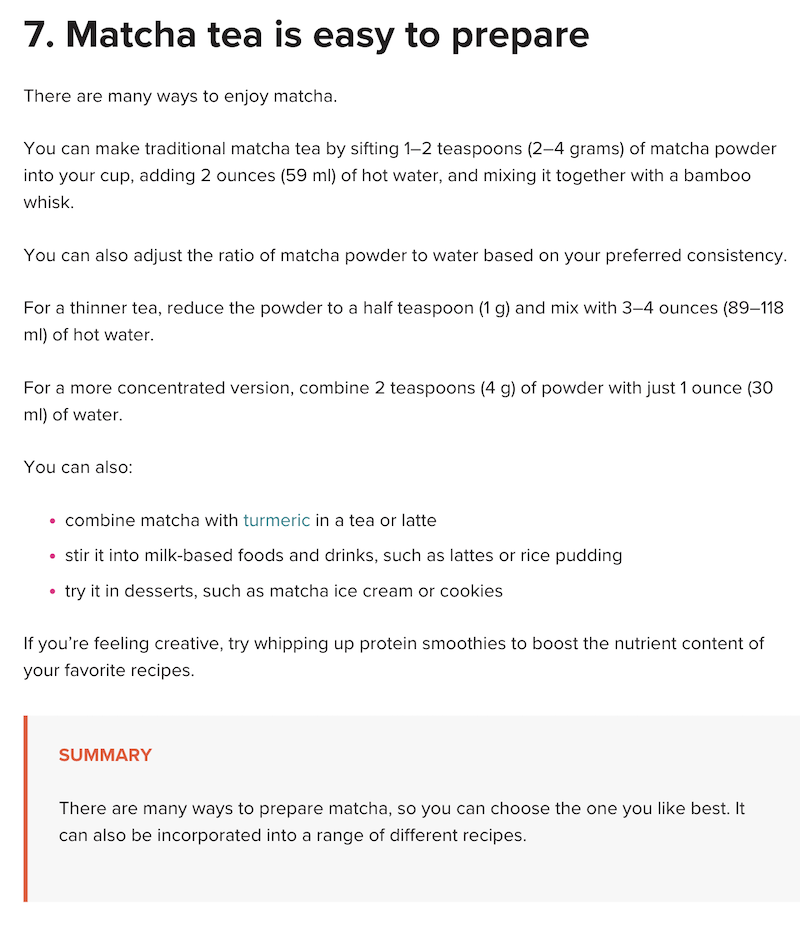
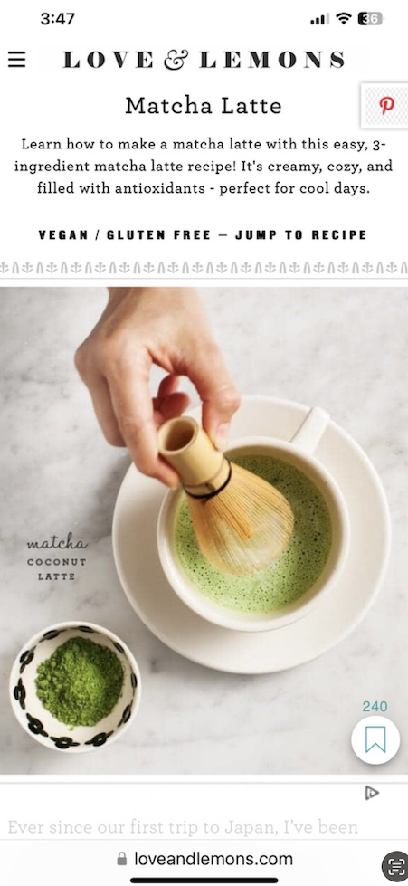

# Project 1, Milestone 2: Design Journey

[← Table of Contents](design-journey.md)

**Replace ALL _TODOs_ with your work.** (There should be no TODOs in the final submission.)

Be clear and concise in your writing. Bullets points are encouraged.

Place all design journey images inside the "design-plan" folder and then link them in Markdown so that they are visible in Markdown Preview.

**Everything, including images, must be visible in _Markdown: Open Preview_.** If it's not visible in the Markdown preview, then we can't grade it. We also can't give you partial credit either. **Please make sure your design journey should is easy to read for the grader;** in Markdown preview the question _and_ answer should have a blank line between them.

## Example Website CSS Property Analysis

For each example website you identified in milestone 1:

1. Include the same screenshot of the example website you included in Milestone 1.
2. Identify 2 parts of the design that you want to analyze for CSS properties.
3. For each part of the design, list the CSS properties for shape, color, and typography that you might use to create a similar design on your personal website.

### Example Website 1 CSS Property Analysis

<https://www.healthline.com/nutrition/7-benefits-of-matcha-tea#antioxidants>

- Blockquote

    Shape CSS Properties:

      - border-left: red;

    Color CSS Properties:

      - background-color: lightgray;
      - color: red;

    Typography CSS Properties:

      - text-transform: uppercase;
      - font-weight: bold;

- Bullet List

    Shape CSS Properties:

      - list-style-type: circle;

    Color CSS Properties:

      - color: turquoise;

    Typography CSS Properties:

      - font-variant: small-case;

### Example Website 2 CSS Property Analysis

<https://www.loveandlemons.com/matcha-latte/>

- First Paragraph

    Shape CSS Properties:

      - border: none

    Color CSS Properties:

      - color: black;

    Typography CSS Properties:

      - font-family

- Second Heading "VEGAN/GLUTEN-FREE

    Shape CSS Properties:

      - border-bottom

    Color CSS Properties:

      - color: black;

    Typography CSS Properties:

      - font-weight: bold;
      - text-transform: uppercase;

## CSS Styling Plan
> Pick one of the examples websites to use as inspiration to begin styling your personal website.
> Explain why you chose the example website and how you plan to use it as inspiration for styling your personal website.

- I chose my second website.

- I chose this website because it utilizes different font-weights and styles to bring out specific information like the headings. I will bring more attention to my headings as well.

## References

### Collaborators
> List any persons you collaborated with on this project.

- None

### Reference Resources
> Did you use any resources not provided by this class to help you complete this assignment?
> Cite any external resources you referenced in the creation of your project. (i.e. W3Schools, StackOverflow, Mozilla, etc.)
>
> List **all** resources you used (websites, articles, books, etc.), including generative AI.
> Provide the URL to the resources you used and include a short description of how you used each resource.

<https://developer.mozilla.org/en-US/docs/Web/CSS/Reference>

- I used the documentation to use elements for site.css.

[← Table of Contents](design-journey.md)
