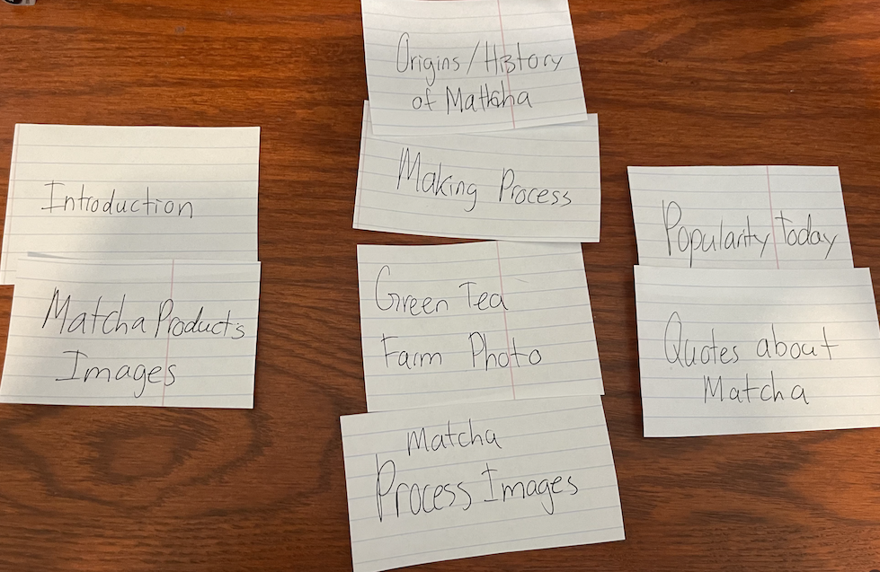
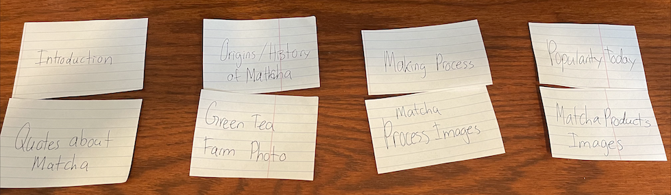

# Project 1, Milestone 3: Design Journey

[← Table of Contents](design-journey.md)

**Replace ALL _TODOs_ with your work.** (There should be no TODOs in the final submission.)

Be clear and concise in your writing. Bullets points are encouraged.

Place all design journey images inside the "design-plan" folder and then link them in Markdown so that they are visible in Markdown Preview.

**Everything, including images, must be visible in _Markdown: Open Preview_.** If it's not visible in the Markdown preview, then we can't grade it. We also can't give you partial credit either. **Please make sure your design journey should is easy to read for the grader;** in Markdown preview the question _and_ answer should have a blank line between them.

## Milestone 2 Feedback Revisions
> Explain what you revised in response to the Milestone 2 feedback (1-2 sentences)
> If you didn't make any revisions, explain why.

- In response to the Milestone 2 feeback, I added an some more elements to my index.html to creat an additional instance of a CSS descendant combinator selector.

## Information Architecture

Design the information architecture for all the pages your website.

You may change your homepage content based on your card sorting. If you do change the homepage content, you don't need to go back to the previous milestone design journey and update it. Instead, just include the new plan in the section below (Content Organization).

### Content Organization
> Document your **iterations** of card sorting here.
> You should have at least 2 iterations of card sorting.
> Include photographic evidence of each iteration of card sorting **and** description of your thought process for each iteration. (1-2 sentences)
> Please physically sort cards; please don't do this digitally.

For this iteration, I organized my content into three sections that focused on different sections of my webpage being the introduction, how matcha is made. and matcha's popularity today. The images correlated to the text content on the pages like how the farm photo and process photos are grouped with the "how matcha is made" page and the quotes from modern day matcha enthusiasts are group with the popularity today page.

For this iteration, the content is split in four sections to again the four different sections of my site (introduction, matcha process, history/origins, and matcha's popularity today). I grouped them accordingly with the images that will help the audience visualize the main message of each page.

### Final Content Organization
> Which iteration of card sorting will you use for your website? (1 sentence)

The second iteration.

> Explain how the final organization of content is appropriate for your site's audiences. (1-2 sentences)

This organization makes sense because it splits the content up evenly and lets them access the different sections of the webpage easily. The associated images also group together well with what the audience will be reading in each page.

This organization is appropriate for my site's audience because it organizes the content into different topics that my webpage addresses so that the user can clearly know what to expect and the information that each page will consist of. The associated images to each page also allows the audience to get a clearer message of each page because they are related to what the text talks about. (I changed my answer because my first response explained why the organization made sense for me rather than the audience)

### Navigation
> Please list the pages you will include in your website's navigation.

- Page 1: Home
- Page 2: History of Matcha
- Page 3: Making Process
- Page 4: Popularity Today

> Explain why the names of these pages make sense for your site's audience. (1-2 sentences)

These pages make sense to the audience because the are a good indicator of what the content in each page will be about.

## References

### Collaborators
> List any persons you collaborated with on this project.

- None

### Reference Resources
> Did you use any resources not provided by this class to help you complete this assignment?
> List any external resources you referenced in the creation of your project. (i.e. W3Schools, StackOverflow, Mozilla, etc.)
>
> List **all** resources you used (websites, articles, books, etc.), including generative AI.
> Provide the URL to the resources you used and include a short description of how you used each resource.

<https://chatgpt.com/>

- I used chatgpt to come up with the content for my website like the assignment instructions instructed us to.

<https://exploreshizuoka.jp/en/inspirations/stories/best-picks/6-great-shizuoka-green-tea-destinations/>

- This is the website for the image matcha-farm.png

<https://www.shizuokatea.com/blog/covering-process-of-japanese-tea-plants/>

- This is the website for the image matcha steaming.png

<https://www.matcha.my/blogs/info/japanese-matcha-growing-processing>

- This is the website for the image matcha shading.png

<https://commons.wikimedia.org/wiki/File:Dried_jakseol_green_tea_leaves.jpg>

- This is the website for the image matcha drying.png

<https://www.shizentea.com/blogs/matcha-vs-green-tea-sencha/grinding-japanese-matcha-powder>

- This is the website for the image matcha grinding.png

<https://shellykongoherbs.com/listing/950513020/japanese-matcha-green-tea-powder-1lb>

- This is the website for the image matcha powder.png

<https://www.spatuladesserts.com/top-25-best-matcha-desserts/>

- This is the website for the image desserts.png

<https://danielfooddiary.com/2020/08/12/matchadrinks/>

- This is the website for the image drinks.png

<https://matchaoutlet.com/blogs/articles/the-history-and-cultural-significance-of-matcha-tea-in-japan#:~:text=The%20Cultural%20Significance%20of%20Matcha%20Tea%3A&text=In%20fact%2C%20the%20Japanese%20have,flavored%20ice%20cream%20and%20mochi.>

<https://developer.mozilla.org/en-US/docs/Web/HTML/Element>

- I used the documentation to use elements for htmls.

[← Table of Contents](design-journey.md)
