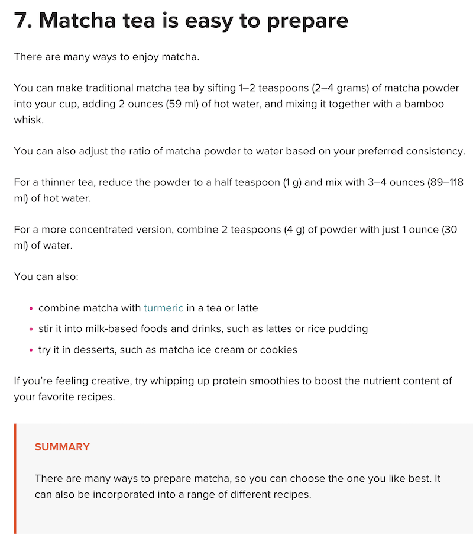
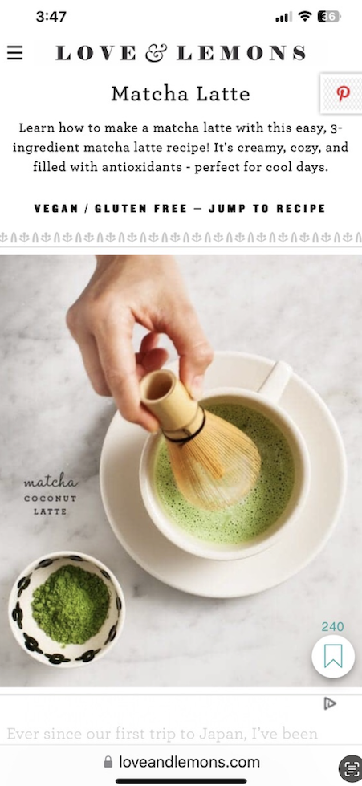

# Project 1, Final Milestone: Design Journey

[← Table of Contents](design-journey.md)

**Replace ALL _TODOs_ with your work.** (There should be no TODOs in the final submission.)

Be clear and concise in your writing. Bullets points are encouraged.

Place all design journey images inside the "design-plan" folder and then link them in Markdown so that they are visible in Markdown Preview.

**Everything, including images, must be visible in _Markdown: Open Preview_.** If it's not visible in the Markdown preview, then we can't grade it. We also can't give you partial credit either. **Please make sure your design journey should is easy to read for the grader;** in Markdown preview the question _and_ answer should have a blank line between them.

## Milestone 3 Feedback Revisions
> Explain what you revised in response to the Milestone 3 feedback (1-2 sentences)
> If you didn't make any revisions, explain why.

I revised my final organization of content for milestone 3 because It didn't explain why the content was organized for the audience but rather for myself.

## Example Website Emotion Analysis

For each example website you identified in milestone 1:

1. Include the same screenshot of the example website you included in Milestone 1.
2. Reflect on the emotions your experience when using the website.
3. Analyze how the website's use of color, decorative imagery, typography, shape, and alignment contribute to these emotions.

### Example Website 1
> Provide the website's URL and a screenshot

<https://www.healthline.com/nutrition/7-benefits-of-matcha-tea#antioxidants>

> What emotions do you feel when you look at this website's design? (1 sentence)

I feel very calm and focused when I look at this web's design.

> How does this website's use of color, decorative imagery, typography, shape, and alignment contribute to these emotions? (2-3 sentences)

The website generally uses minimalistic colors and the same font for most of the text to portay a neat and organized website that allows the audience to consume the content without many distraction. It used only used a vibrant red color for the bullet points and the summary on the bottom which additionally has a left border as well as a subtle background that draws slight, but not excessive, attention to it.

### Example Website 2

> Provide the website's URL and a screenshot

<https://www.loveandlemons.com/matcha-latte/>

> What emotions do you feel when you look at this website's design? (1 sentence)

I feel very comfortable and well-organized when I look at the clean design of this website.

> How does this website's use of color, decorative imagery, typography, shape, and alignment contribute to these emotions? (2-3 sentences)

This website uses minimalistic colors and images to portray a simplistic and easy-to-follow design as it's purpose is to teach the audience an easy recipe for matcha lattes. The typography consists of more decorative and stylish fonts which portrays a stylish and clean feel to the content. There are no strong shapes which gives the website an overall clean and open look.

## Website Design

### Emotion Reflection
> What emotions would you like the visitors of your website to experience? Why? (1-2 sentences)

I would like to envoke feelings of curiosity but comfortability to the visitors of my website so that they are able to engage with the content in a way that also allows them to learn new information with ease.

### Design Principle Brainstorm
> Reflect on how you might use color, decorative imagery, typography, shape, and alignment to evoke these emotions. (2-3 sentences)

I want to use different, complimenting hues of green in my site and images to fit the matcha theme of my website but stick to a few different shades so that I preserve the organized and comfortable look of my site. Similar to my example website 2, I want to use stylish fonts to create a entertaining design but make the text left-aligned so that it will be easy to read for my viewers. I want to use borders sparingly to preseve the clean look of my site and use them for only a couple important sections that should stand out.

### Home Page Sketches
> Sketch **two** different possible designs for your home page.
> Provide an explanation for each sketch explaining the idea. (1 sentence per sketch)

- The idea for this sketch was to use bottom borders instead of full borders for titles and headings to give the homepage a cleaner and more open look.

- The idea for this sketch was to utlize borders to create more structure and emphasis on the headings so that readers can follow the flow of content easily

### Entire Website's Design
> Pick the version of the home page that you will use for your final design.

> Plan the design for the rest of your website.
> Include a sketch for each of the remaining pages of your website.
> Label each sketch, so that we understand what page we are reviewing. (1 short phrase per sketch)

- Sketch for history.html

- Sketch for process.html

- Sketch for popularitytoday.html

### Static Website Design Check
> We're building a static website without interactivity.
> **No part of your website may dynamically change.**
> Examples of dynamic behavior are dropdown menus, hamburger menus, popups, modals/lightboxes, image carousels, etc.
> Audit your design and check that you aren't relying on any dynamic features. (1 sentence)

- My site's design is static and without any dynamic behavior because there is no usage of any interactive features on it.

## Self-Reflection
> Take some time here to reflect on how much you've learned since you started this class. It's often easy to ignore our own progress. Take a moment and think about your accomplishments in this class. Hopefully you'll recognize that you've accomplished a lot and that you should be very proud of those accomplishments!

I've learned how to make html files that structure how I want content to be formated on a website as well as how to style the website using different CSS properities. I also learned how to properly use images, links, and other sources that are not my own in my website. I learned a lot about developing website with the audience and their goals in mind rather than my own design ideas.

## References

### Collaborators
> List any persons you collaborated with on this project.

None

### Reference Resources
> Did you use any resources not provided by this class to help you complete this assignment?
> List any external resources you referenced in the creation of your project. (i.e. W3Schools, StackOverflow, Mozilla, etc.)
>
> List **all** resources you used (websites, articles, books, etc.), including generative AI.
> Provide the URL to the resources you used and include a short description of how you used each resource.

<https://chatgpt.com/>

- I used chatgpt to come up with the content for my website like the assignment instructions instructed us to.

<https://exploreshizuoka.jp/en/inspirations/stories/best-picks/6-great-shizuoka-green-tea-destinations/>

- This is the website for the image matcha-farm.png

<https://www.shizuokatea.com/blog/covering-process-of-japanese-tea-plants/>

- This is the website for the image matcha-steaming.png

<https://www.matcha.my/blogs/info/japanese-matcha-growing-processing>

- This is the website for the image matcha-shading.png

<https://commons.wikimedia.org/wiki/File:Dried_jakseol_green_tea_leaves.jpg>

- This is the website for the image matcha-drying.png

<https://www.shizentea.com/blogs/matcha-vs-green-tea-sencha/grinding-japanese-matcha-powder>

- This is the website for the image matcha grinding.png

<https://shellykongoherbs.com/listing/950513020/japanese-matcha-green-tea-powder-1lb>

- This is the website for the image matcha-powder.png

<https://www.spatuladesserts.com/top-25-best-matcha-desserts/>

- This is the website for the image desserts.png

<https://danielfooddiary.com/2020/08/12/matchadrinks/>

- This is the website for the image drinks.png

<https://www.forbes.com/health/supplements/matcha-tea-health-benefits/>

- This is the website for the image homepage-pic.png

<https://clipart-library.com/free/border-clipart-png.html >

- This is the website for the image fancy-border.png

<https://www.shecodes.io/challenge_submissions/507165/embed>

- This is the website for the image matcha-decor.png

<https://matchaoutlet.com/blogs/articles/the-history-and-cultural-significance-of-matcha-tea-in-japan#:~:text=The%20Cultural%20Significance%20of%20Matcha%20Tea%3A&text=In%20fact%2C%20the%20Japanese%20have,flavored%20ice%20cream%20and%20mochi.>

- This is the source for my quotes on my index.html

<https://developer.mozilla.org/en-US/docs/Web/HTML/Element>

- I used the documentation to use elements for html and css.

[← Table of Contents](design-journey.md)
